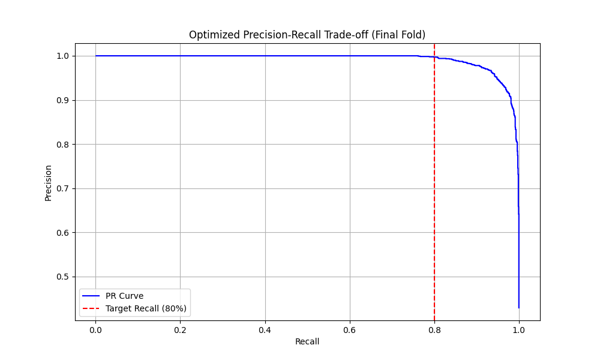
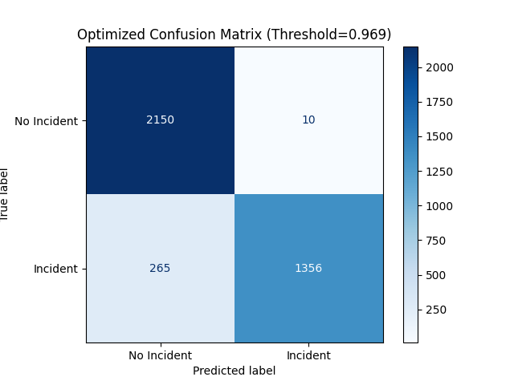

# Predictive Alerting for Cloud Service Metrics

This project implements a predictive alerting system designed to anticipate incidents in cloud services based on historical metric data. It focuses on predicting whether an incident will occur within a future horizon ($H$) based on a historical window ($W$) of time-series data.

## Project Overview

Cloud service metrics (e.g., CPU, memory, temperature) are often non-stationary and heavy-tailed. Traditional threshold-based alerts often fire too late or produce too many false positives. This system uses a machine learning approach to provide "lead time," allowing DevOps teams to intervene before a service degradation becomes critical.

## Dataset: Numenta Anomaly Benchmark (NAB)

This project utilizes the **machine_temperature_system_failure.csv** dataset from the [Numenta Anomaly Benchmark (NAB)](https://github.com/numenta/NAB). This dataset was chosen for its real-world relevance, containing actual telemetry from an industrial machine rather than synthetic data. Its patterns, including noise, seasonal shifts, and sudden spikes, closely mirror those found in cloud infrastructure metrics like CPU or disk temperature. As a widely recognized open-source framework, NAB serves as a standard benchmark for evaluating streaming anomaly detection algorithms, providing a rigorous baseline for our predictive alerting system.

The dataset contains 22,695 readings recorded at 5-minute intervals and is downloaded directly from the NAB GitHub repository each time the script runs, so an internet connection is required.

### Incident Definition
The NAB anomaly labels are **not** used. Instead, an incident is defined with a fixed temperature threshold: any reading with `value >= 95.0` (`CRITICAL_THRESHOLD` in `main.py`) is marked as an incident. Under this definition roughly 21.6% of all readings are incidents, and breaches typically last several consecutive steps (the series contains 299 separate breach onsets).

## Design Decisions & Model Selection

### 1. Problem Formulation: Sliding Window & Horizon
To transform the raw, continuous time-series data into a supervised learning problem, we employ a Sliding Window formulation. The system uses a historical window of $W$ steps to predict whether an anomaly will occur within a future horizon of $H$ steps. Rather than fixing $W$ and $H$ manually, their optimal values are determined automatically via Bayesian Optimization (see Section 3). By calculating rolling statistics (mean, standard deviation, minimum, and maximum) over the window $W$, together with the current reading, we provide the model with a contextual "memory" of local dependencies and trends. This feature-engineered approach is significantly more robust to the non-stationary environments and baseline shifts typical of cloud workloads, achieving effective results without the computational weight of recurrent architectures like LSTMs. This technique is supported by [Dietterich (2002)](https://web.engr.oregonstate.edu/~tgd/publications/mlsd-ssspr.pdf), who highlights the sliding window as a fundamental method for capturing temporal patterns in sequential data.

### 2. Model Choice: Random Forest Classifier
The core model selected for this task is a Random Forest (RF) classifier with balanced class weights. In cloud metrics, anomalies often manifest as sudden, heavy-tailed spikes, and Random Forests naturally partition the feature space to isolate them into specific leaf nodes without skewing the entire model. Furthermore, tree-based models are computationally efficient to retrain, fitting the operational requirements of frequent model updates in cloud environments. Research by [Grinsztajn et al. (2022)](https://arxiv.org/abs/2207.08815) empirically demonstrates that for tabular and feature-engineered datasets like ours, tree-based models consistently outperform Deep Learning architectures while requiring less tuning and offering greater robustness.

### 3. Automated Parameter Optimization (Bayesian Opt)
To move beyond arbitrary parameter selection, we leverage [Optuna](https://optuna.org/) for Bayesian Optimization. This allows us to find the "sweet spot" for the window size ($W$) and horizon ($H$) that maximizes precision at an 80% recall target. In each fold, the operating point on the PR curve whose recall is closest to 80% is selected, so the achieved recall can land slightly above or below the target; recall is not enforced as a hard constraint. By exploring the hyperparameter space—including Random Forest depth and tree count—more efficiently than a standard grid search, Bayesian Optimization ensures the alerting system is precisely tuned to the unique noise patterns and characteristics of the telemetric data.

### 4. Evaluation Strategy: Walk-Forward Validation & PR Curves
Time-series data, particularly cloud telemetry, is susceptible to temporal drift, where what constitutes "normal" behavior on a Tuesday morning might trigger an alert on a Sunday night. Standard random train/test splits allow "future" data to leak into the training set, creating unrealistically high performance metrics. For that reason, this system employs **Walk-Forward Validation** (`TimeSeriesSplit`). The model is trained and evaluated sequentially across five chronological folds, simulating how it would perform in production as new data arrives and the model is periodically retrained.

Furthermore, performance is evaluated using the **Precision-Recall (PR) curve** instead of standard accuracy or ROC curves. This choice is motivated by the class imbalance typical of cloud incident data (in this dataset, about 22% of readings are incidents). Standard ROC curves can be misleading because the massive pool of True Negatives keeps the False Positive Rate artificially low. As mathematically demonstrated by [Saito & Rehmsmeier (2015)](https://journals.plos.org/plosone/article?id=10.1371/journal.pone.0118432), PR curves provide a significantly more informative assessment for binary classifiers on datasets with severe class imbalance.

## Setup & Running

This project uses a Python virtual environment to manage dependencies.

### 1. Setup Virtual Environment
Navigate to the project directory and run:

```bash
python3 -m venv venv

# macOS/Linux:
source venv/bin/activate
# Windows:
# .\venv\Scripts\activate
```

### 2. Install Dependencies
Install the required libraries using the provided `requirements.txt`:

```bash
pip install -r requirements.txt
```

### 3. Run

```bash
python main.py
```

The script downloads the dataset, runs 100 Optuna trials (each trial trains five Random Forests), prints the final metrics, and writes `pr_curve.png` and `confusion_matrix.png` to the current directory, overwriting any existing copies. Expect it to take several minutes depending on your CPU.

> **Note:** `main.py` calls `setup_ssl()`, which disables SSL certificate verification for the whole Python process to work around certificate issues common on macOS. If your system certificates are configured correctly, you can remove that call.

## Project Structure

| File | Description |
|:---|:---|
| `main.py` | Data loading, feature engineering, Optuna search, walk-forward evaluation, and plotting |
| `requirements.txt` | Python dependencies |
| `pr_curve.png` | Precision-Recall curve for the final fold |
| `confusion_matrix.png` | Confusion matrix for the final fold |

## Results Analysis
The system uses **Bayesian Optimization (100 trials)** coupled with Walk-Forward Validation to find parameters that are robust across multiple time periods, rather than overfitting to a specific data split.

The Optuna study is not seeded and runs trials in parallel, so repeated runs may select different parameters and produce slightly different numbers from those below.

### Optimized Parameters
- **Window ($W$):** 5 steps (25 min)
- **Horizon ($H$):** 4 steps (20 min)
- **Random Forest:** 116 trees, max depth 6
- **Decision Threshold:** 0.969 (the mean of the five per-fold thresholds, applied to the final fold)

### Performance

| Metric | Value | Scope | Notes |
|:---|:---:|:---|:---|
| **Recall** | **80.31%** | Mean across folds | Close to the 80% target: the model catches about 4 out of 5 incident windows. |
| **Precision** | **99.37%** | Mean across folds | Very few false alarms (see limitations below). |
| **False Positive Rate** | **0.46%** | Final fold | |
| **Lead Time** | **5.3 min** | Final fold | Average time between a correct alert and the next incident step. |

### Limitations

These results should be read with the following caveats:

- **Many positives are ongoing breaches.** A row is labeled positive if any of the next $H$ steps is an incident. Because breaches last several steps, about 88% of positive rows (with $H = 4$) are already at or above 95 at prediction time, and the current reading is itself a feature. A large share of the high precision therefore comes from predicting that an active breach will continue, rather than anticipating a new one.
- **Lead time is short.** The minimum possible lead time is one step (5 minutes). An average of 5.3 minutes means nearly every correct alert fires exactly one step before an incident step, so the practical early warning is far shorter than the 20-minute horizon suggests.
- **No held-out test set.** Hyperparameters are chosen by maximizing precision on the same walk-forward folds whose metrics are reported, so the numbers are optimistic.

Possible next steps are to predict only breach onsets (excluding rows already in an incident), evaluate on a held-out time period not used during tuning, and compare against the NAB anomaly labels.

### Plots

#### Precision-Recall Curve



#### Confusion Matrix



## License

This project is released under the [MIT License](LICENSE).
